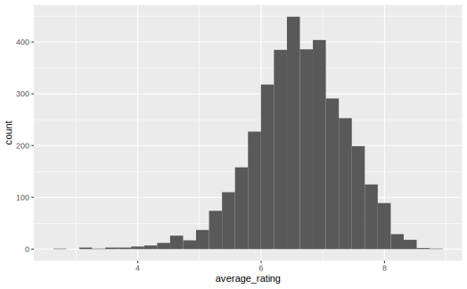
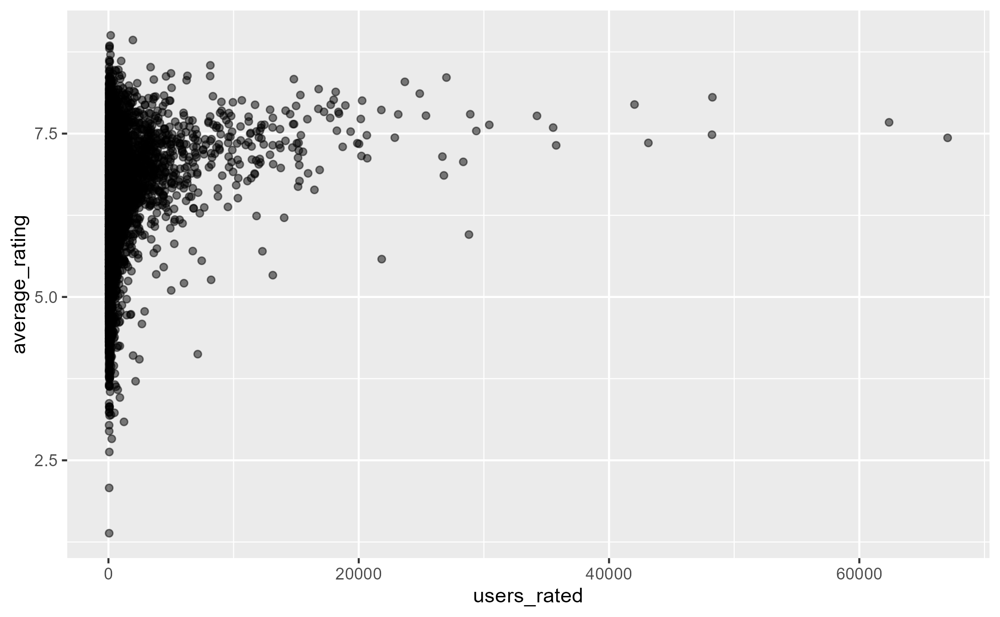
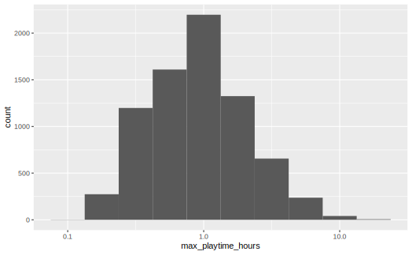
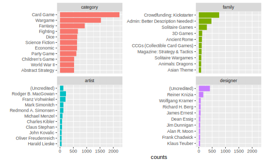
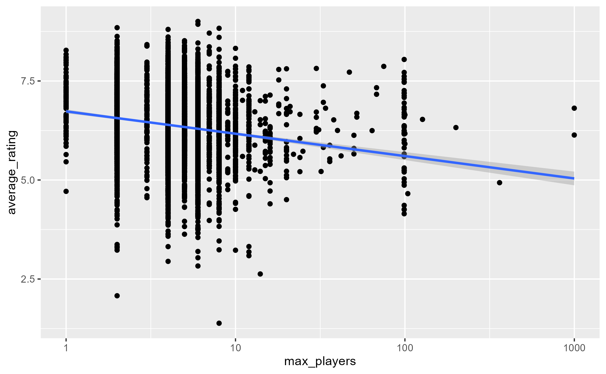
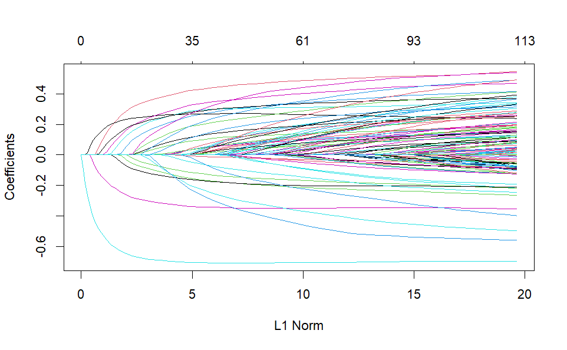
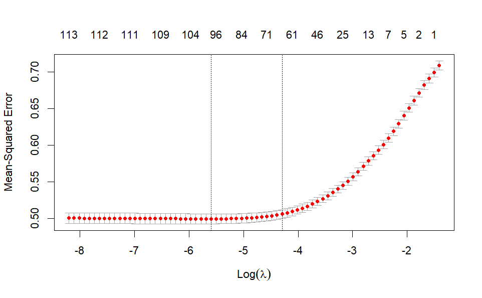
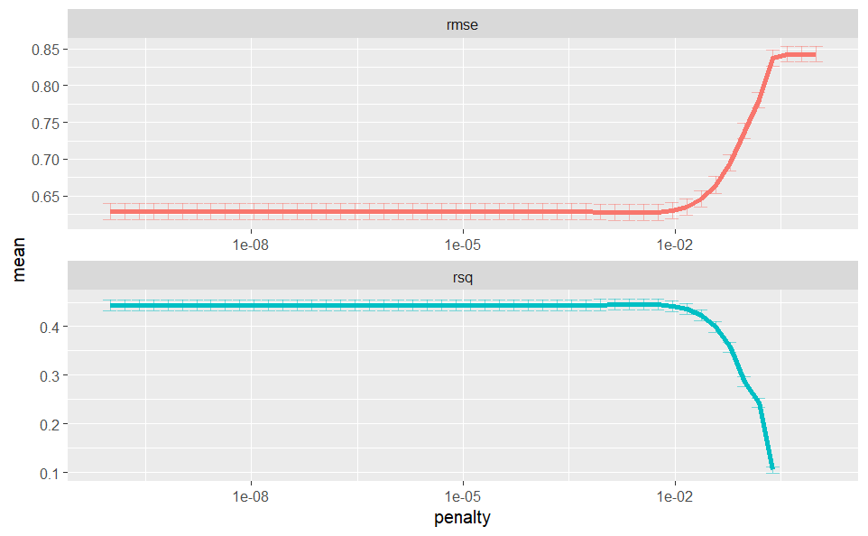

# Predicting Board Games Ratings

The following analysis uses the data provided by the [#TidyTuesday](https://github.com/rfordatascience/tidytuesday) social data project. The main focus here is to explain the steps behind my analysis of the provided data.

The [dataset](https://github.com/rfordatascience/tidytuesday/tree/master/data/2019/2019-03-12) contains details about Board Games including crowd-sourced ratings. Assuming that ratings are important for a Board Game, let's say to be profitable, the analysis aims to predict ratings by developing a machine learning model using R.

Since the outcome variable is provided and it takes a continuous value the problem will be framed as a **supervised learning regression model**.

## Data Understanding

Before anything is a good idea to get feel about the data first, to asses distribution types, missing values, formatting issues, or other relevant steps to be handled prior to exploration.

```r
# Used libraries
library(tidyverse)
library(skimr)

# Loading the data
board_games_raw <- read_csv("board_games.csv")

# Assesing overall details, shape
skim(board_games_raw)
board_games_raw |> slice_head(n = 1) |> glimpse()
```
<details>
<summary>Output</summary>
<pre>
── Variable type: character 
   skim_variable n_missing complete_rate min   max empty n_unique whitespace
 1 description           0        1       49 11476     0    10528          0
 2 image                 1        1.00    40    44     0    10527          0
 3 name                  0        1        1    84     0    10357          0
 4 thumbnail             1        1.00    42    46     0    10527          0
 5 artist             2773        0.737    3  6860     0     4641          0
 6 category             94        0.991    4   173     0     3860          0
 7 compilation       10122        0.0389   4   734     0      336          0
 8 designer            126        0.988    3   184     0     4678          0
 9 expansion          7780        0.261    2 11325     0     2634          0
10 family             2808        0.733    2  1779     0     3918          0
11 mechanic            950        0.910    6   314     0     3209          0
12 publisher             3        1.00     2  2396     0     5512          0

── Variable type: numeric 
   skim_variable  n_missing complete_rate     mean        sd      p0     p25      p50       p75      p100 hist 
 1 game_id                0             1 62059.   66224.       1    5444.   28822.   126410.   216725    ▇▁▁▂▁
 2 max_players            0             1     5.66    18.9      0       4        4         6       999    ▇▁▁▁▁
 3 max_playtime           0             1    91.3    660.       0      30       45        90     60000    ▇▁▁▁▁
 4 min_age                0             1     9.71     3.45     0       8       10        12        42    ▅▇▁▁▁
 5 min_players            0             1     2.07     0.664    0       2        2         2         9    ▁▇▁▁▁
 6 min_playtime           0             1    80.9    638.       0      25       45        90     60000    ▇▁▁▁▁
 7 playing_time           0             1    91.3    660.       0      30       45        90     60000    ▇▁▁▁▁
 8 year_published         0             1  2003.      12.3   1950    1998     2007      2012      2016    ▁▁▁▂▇
 9 average_rating         0             1     6.37     0.850    1.38    5.83     6.39      6.94      9.00 ▁▁▃▇▁
10 users_rated            0             1   870.    2880.      50      85      176       518     67655    ▇▁▁▁▁

── Columns: 22
$ game_id        <dbl> 1
$ description    <chr> "Die Macher is a game about seven sequential political…"
$ image          <chr> "//cf.geekdo-images.com/images/pic159509.jpg"
$ max_players    <dbl> 5
$ max_playtime   <dbl> 240
$ min_age        <dbl> 14
$ min_players    <dbl> 3
$ min_playtime   <dbl> 240
$ name           <chr> "Die Macher"
$ playing_time   <dbl> 240
$ thumbnail      <chr> "//cf.geekdo-images.com/images/pic159509_t.jpg"
$ year_published <dbl> 1986
$ artist         <chr> "Marcus Gschwendtner"
$ category       <chr> "Economic,Negotiation,Political"
$ compilation    <chr> NA
$ designer       <chr> "Karl-Heinz Schmiel"
$ expansion      <chr> NA
$ family         <chr> "Country: Germany,Valley Games Classic Line"
$ mechanic       <chr> "Area Control / Area Influence,Auction/Bidding,Dice…"
$ publisher      <chr> "Hans im Glück Verlags-GmbH,Moskito Spiele,Valley Games,…"
$ average_rating <dbl> 7.66508
$ users_rated    <dbl> 4498
</pre>
</details>

An initial skimming reveals the following:

- From the strings variables *image* and *thumbnail* provide links to the game cover but would hardly be useful.

- The variables _expansion_ and _compilation_ have the highest missing values, but only because they contain values for when the game has those features. If taken into account it would be a good idea to convert them to booleans instead.

- The number of users who rated a game could introduce noise in the actual ratings. Maybe set a threshold for keeping observations above a certain level.

- The variables _family_, _mechanic_, _publisher_, and _category_ seem to be multilevel factors, meaning that a single observation can have multiple values, in this case, comma separated.

---

Since the goal is to develop a machine learning model, a subset of the data will be left on hold for later model evaluation.

```r
# Setting a seed for reproducibility
set.seed(111)

# Splitting the data
board_games_split <- initial_split(board_games_raw)
board_games <- training(board_games_split)
board_games_test <- testing(board_games_split)

# For model tunning
set.seed(222)
game_folds <- vfold_cv(board_games)
```

## Exploratory Data Analysis

**How are rating values distributed?**

From the histogram below ratings appear to be normally distributed with fewer observations in the left tail. Filtering for games with at least 200 ratings doesn't seem to be changing the distribution, only the tail at lower ratings gets reduced, probably because people don't usually buy bad-rated games, aka, fewer people rating them.

```r
board_games |>
  # toggling the filter doesn't seem to change the distribution
  filter(users_rated > 200) |>
  ggplot(aes(average_rating)) +
  geom_histogram()
```



**How do ratings vary considering the number of users who rated the game?**

The larger the sample size (users rated), the lower the rating noise and the more concentrated it is around 7.5. This is just the central limit theorem in real life.

```r
board_games |>
  ggplot(aes(users_rated, average_rating)) +
  geom_point(alpha = 0.5)
```



**What is the evolution of total games published by year?**

There are more board games published since 2000, this could indicate that board games have become more popular over the years, not conclusive though without contrast with external sources of information. There was a decrease in 2016, though it's probably because the dataset was aggregated during that year.

```r
board_games |>
  count(year_published) |>
  arrange(desc(year_published)) |>
  ggplot(aes(year_published, n)) +
  geom_line()
```


<!--  -->

**What is the distribution of maximum recommended playtime?**

The units of measurement are in minutes. But when building the plot some weird values appeared: play times range from 0 till 60000 (a thousand hours or game). Doesn't seem too realistic, or does it 🤔?. By reducing the range of the variable the distribution keeps showing a long right tail. This is kind of common when dealing with units of time. By taking the logarithm it approximates a normal distribution. This will be important when building the model.

```r
board_games |>
  filter(max_playtime > 5, max_playtime < 1000) |>
  mutate(max_playtime_hours = max_playtime / 60) |>
  ggplot(aes(max_playtime_hours)) +
  geom_histogram(binwidth = .25) +
  scale_x_log10()
```



**The most common board game categories, families?**

As seen previously some of the categorical variables can take many values, as in the case of the board game category. Some feature engineering is done to extract the values in a more tidy fashion to make it easier to work with for both visualization and model building.

```r
categorical_vars <- board_games |>
  select(game_id, name, family, category, artist, designer) |>
  pivot_longer(
    cols = !c("game_id", "name"),
    names_to = "type",
    values_to = "value"
  ) |>
  filter(!is.na(value)) |>
  separate_longer_delim(value, delim = ",") |>
  arrange(game_id)
```

Having one observation per category makes it easier to compute aggregations, and answer the question about the frequency of the values present in each categorical variable.

```r
categorical_vars |>
  count(type, value, sort=TRUE) |>
  group_by(type) |>
  slice_max(n, n = 10) |>
  ungroup() |>
  mutate(
    value = fct_reorder(value, n),
    type = fct_reorder(type, n, .desc = TRUE)) |>
  ggplot(aes(n, value, fill = type)) +
  geom_col(show.legend = FALSE) +
  facet_wrap(~type, scales = "free_y")
```



By looking at the plot, the category of the game has more occurrences than other variables like _designer_. Nonetheless, it is not the case that game category beats all other variables since, for example, the most common family game _Crowfunding_ has more occurrences than the remaining after the top 3 category games. So other categorical variables could have predictive power as well.

## Model Building

Without considering any variable besides the rating and using it as a base model, the residual standard error is 0.8497, meaning that by just taking the average of ratings a new prediction is expected to be off by 0.8497 rating points.

```r
lm(average_rating ~ 1, board_games) |>
  summary()
```

<pre>
Call:
lm(formula = average_rating ~ 1, data = board_games)

Residuals:
    Min      1Q  Median      3Q     Max 
-4.9919 -0.5346  0.0207  0.5663  2.6278 

Coefficients:
            Estimate Std. Error t value Pr(>|t|)    
(Intercept) 6.376076   0.009484   672.3   <2e-16 ***
---
Signif. codes:  0 ‘***’ 0.001 ‘**’ 0.01 ‘*’ 0.05 ‘.’ 0.1 ‘ ’ 1

Residual standard error: 0.8429 on 7898 degrees of freedom
</pre>

### Warming out with predictors

Using max_players to explain the variation in ratings has almost no effect. The residual standard error is almost identical. But it does say that games with more players tend to get lower ratings by a minuscule amount: for every unit increment in the number of players, the rating drops by -0.0014.

```r
lm(average_rating ~ max_players, board_games) |>
  summary()
```

<pre>
Call:
lm(formula = average_rating ~ max_players, data = board_games)

Residuals:
    Min      1Q  Median      3Q     Max 
-4.9887 -0.5356  0.0212  0.5652  2.6282 

Coefficients:
              Estimate Std. Error t value Pr(>|t|)    
(Intercept)  6.3841165  0.0099276 643.069  < 2e-16 ***
max_players -0.0014050  0.0005149  -2.729  0.00637 ** 
---
Signif. codes:  0 ‘***’ 0.001 ‘**’ 0.01 ‘*’ 0.05 ‘.’ 0.1 ‘ ’ 1

Residual standard error: 0.8426 on 7897 degrees of freedom
Multiple R-squared:  0.000942,	Adjusted R-squared:  0.0008155 
F-statistic: 7.446 on 1 and 7897 DF,  p-value: 0.006371
</pre>

By exploring the distribution of maximum recommended players something similar to the maximum recommended play time arises, in that it is probably useful to convert it first to a logarithmic scale.

```r
board_games |>
  filter(max_players > 0) |>
  ggplot(aes(max_players, average_rating)) +
  geom_point() +
  geom_smooth(method='lm') +
  scale_x_log10()
```



So, when transforming the max_players to a log scale it starts to get a greater effect: **for every doubling of the number of players the rating is expected to decrease by 0.17785**.

Nevertheless, the residual standard error doesn't improve, 0.84

```r
# adding 1 to avoid 0 players
lm(average_rating ~ log2(max_players + 1), board_games) |>
  summary()
```

<pre>
Call:
lm(formula = average_rating ~ log2(max_players + 1), data = board_games)

Residuals:
    Min      1Q  Median      3Q     Max 
-4.8554 -0.5293  0.0206  0.5644  2.6980 

Coefficients:
                      Estimate Std. Error t value Pr(>|t|)    
(Intercept)            6.81908    0.03279   207.9   <2e-16 ***
log2(max_players + 1) -0.18280    0.01297   -14.1   <2e-16 ***
---
Signif. codes:  0 ‘***’ 0.001 ‘**’ 0.01 ‘*’ 0.05 ‘.’ 0.1 ‘ ’ 1

Residual standard error: 0.8326 on 7897 degrees of freedom
Multiple R-squared:  0.02455,	Adjusted R-squared:  0.02442 
F-statistic: 198.7 on 1 and 7897 DF,  p-value: < 2.2e-16
</pre>

Taking max_playtime into account exposes that:

- Every doubling in the recommended number of players the rating is expected to decrease by 0.15.

- Every doubling in the recommended play time the rating is expected to increase by 0.13.

So, **longer games with fewer players tend to score better**. By a little. Now it is a slightly better model than the baseline since the residual standard error has decreased.

```r
lm(average_rating ~
     log2(max_players + 1) +
     log2(max_playtime + 1), board_games) |>
  summary()
```

<pre>
Call:
lm(formula = average_rating ~ log2(max_players + 1) + log2(max_playtime + 
    1), data = board_games)

Residuals:
    Min      1Q  Median      3Q     Max 
-4.9233 -0.5041  0.0314  0.5326  2.8203 

Coefficients:
                        Estimate Std. Error t value Pr(>|t|)    
(Intercept)             6.062075   0.045713  132.61   <2e-16 ***
log2(max_players + 1)  -0.161968   0.012587  -12.87   <2e-16 ***
log2(max_playtime + 1)  0.127952   0.005559   23.02   <2e-16 ***
---
Signif. codes:  0 ‘***’ 0.001 ‘**’ 0.01 ‘*’ 0.05 ‘.’ 0.1 ‘ ’ 1

Residual standard error: 0.806 on 7896 degrees of freedom
Multiple R-squared:  0.08587,	Adjusted R-squared:  0.08564 
F-statistic: 370.9 on 2 and 7896 DF,  p-value: < 2.2e-16
</pre>

By taking just these features into account the model outperforms the baseline but on their own can't explain the variation on the ratings, and this is exposed by looking at the R-squared: **the predictors explain only about ~9% of the variation of the ratings.** So, it is necessary to include more relevant predictors or a different combination of them.

### Exploring other variables

- max_playtime and max_players are probably correlated to their *min* equivalents, so it's reasonable to skip them for now since correlated features are not well suited to be modeled linearly.

- The average rating has been increasing over the years and not by a little. The trend is not quite linear, but it's not unreasonable to model it in that way.

```r
lm(average_rating ~ 
     log2(max_players + 1) +
     log2(max_playtime + 1) +
     year_published, board_games) |> 
  summary()
```

<pre>
Call:
lm(formula = average_rating ~ log2(max_players + 1) + log2(max_playtime + 
    1) + year_published, data = board_games)

Residuals:
    Min      1Q  Median      3Q     Max 
-4.9832 -0.4455  0.0215  0.4801  2.7404 

Coefficients:
                         Estimate Std. Error t value Pr(>|t|)    
(Intercept)            -46.691830   1.403317  -33.27   <2e-16 ***
log2(max_players + 1)   -0.198114   0.011632  -17.03   <2e-16 ***
log2(max_playtime + 1)   0.160830   0.005194   30.96   <2e-16 ***
year_published           0.026288   0.000699   37.61   <2e-16 ***
---
Signif. codes:  0 ‘***’ 0.001 ‘**’ 0.01 ‘*’ 0.05 ‘.’ 0.1 ‘ ’ 1

Residual standard error: 0.7423 on 7895 degrees of freedom
Multiple R-squared:  0.2248,	Adjusted R-squared:  0.2245 
F-statistic:   763 on 3 and 7895 DF,  p-value: < 2.2e-16
</pre>

By including the year in the model, the rating is expected to increase by 0.0264 and both the R-squared and the residual standard error had improved.

Now, it's impossible to launch a game previous to the current year, but it's important to control for it, not because a new game with the same categories as one in let's say 1950 will score the same since the popularity of that category could have increased over the years, and it has in general.

### Modeling categorical variables

Getting a sense of how the categorical features are related to the outcome variable would hint if there is a reason to include them in the modeling.

```r
board_games |> 
  inner_join(categorical_vars, by = c("game_id", "name")) |>
  filter(type == "artist") |> 
  mutate(value = fct_lump_n(value, n = 15),
         value = fct_reorder(value, average_rating)) |>
  ggplot(aes(average_rating, value)) +
  geom_boxplot()
```


Comparing the distribution of average ratings per artist shows a correlation with higher or lower-rated games. A boxplot comparing the values shows actual differences in the rating based on *artist*. So, it seems reasonable to use categorical variables to model ratings.

The difference in ratings per artist in this case should not be interpreted as causation, since a game with a higher rating could not be due to the artist but maybe a related feature, a good publisher for example.

To use categorical features for machine learning models is necessary to encode the levels and set them as predictors. In this case, since the categorical variables can have multiple levels it is not possible to apply the traditional one-hot encoding with a reference category, since **there's no implicit baseline**: a game can have the category of Card Game but can also be labeled as Fantasy.

Also, given the amount of category levels it would be reasonable to exclude the combinations with a minimum number of observations.

```r
# Setting a threshold of at least 50 observations
features <- categorical_vars |> 
  unite("feature", type, value) |> 
  add_count(feature) |> 
  filter(n >= 50)
```

Beyond the number of combinations, it is also possible that many will be correlated, thus, trying to make a regression with that many variables could lead to overfitting. To avoid that, a **Lasso Regression Model** is a better choice than Linear Regression since Lasso would filter out correlated features, penalizing features with little predictive power, reducing model complexity, and aiding with interpretability.

```r
library(glmnet)
library(Matrix)

# Creating an sparce binary matrix of categorical predictors
# rows: game id - columns: categorical feature values
feature_matrix <- features |> 
  cast_sparse(game_id, feature)

# Outcome
ratings <- board_games$average_rating[match(rownames(feature_matrix), board_games$game_id)]

# Lasso model
# glmnet defaults to lasso (alpha = 1) and to linear model (family = "gaussian")
lasso_fit <- glmnet(feature_matrix, ratings)

plot(lasso_fit)
```



The plot above shows how the predictor's coefficients get penalized by basically removing them at lower values of L1 Norm (**sum of the absolute values of the coefficients**), aka, large penalization (large values of the hyperparameter lambda). The algorithm keeps decreasing lambda and adding more parameters.

```r
lasso_fit |> 
  tidy() |> 
  arrange(step)
```

<pre>
# A tibble: 5,051 × 5
   term                   step estimate lambda dev.ratio
   <chr>                 <dbl>    <dbl>  <dbl>     <dbl>
 1 (Intercept)               1   6.38    0.244    0     
 2 (Intercept)               2   6.38    0.223    0.0143
 3 designer_(Uncredited)     2  -0.0969  0.223    0.0143
 4 (Intercept)               3   6.39    0.203    0.0262
 5 designer_(Uncredited)     3  -0.185   0.203    0.0262
 6 (Intercept)               4   6.39    0.185    0.0388
 7 category_Wargame          4   0.0147  0.185    0.0388
 8 designer_(Uncredited)     4  -0.263   0.185    0.0388
 9 (Intercept)               5   6.38    0.168    0.0538
10 category_Wargame          5   0.0528  0.168    0.0538
# ℹ 5,041 more rows
</pre>

On its own, the model's output it's not that useful since it shows all the possible values of lambda taken. The challenge is to choose an optimal value of lambda that minimizes the model error. Cross-validation can be used instead to select the best lambda.

```r
# Ussing cv.glmnet to perform cross validation
cv_lasso_fit <- 
  cv.glmnet(feature_matrix, ratings)

plot(cv_lasso_fit)
```



Lambda can take values starting at zero, so since the plot above shows the logarithm of lambda, its optimal values are between 0 and 1. In particular, the optimal lambda is set at around -6 (left vertical dotted line) which minimizes the model error (MSE). The line at -4 is one standard error from the optimal value. It is also a good value of lambda and it has the advantage of having fewer predictors, which can be good for interpretability (around \~70 parameters contribute to most of the gain).

As lambda decreases the MSE goes down and it flattens out, so there's not much risk of overfitting, which would be the case if the error had started increasing again. This means that it is not a bad idea to lower the threshold set on the number of times a categorical variable value appears.

```r
chosen_lambda <- cv_lasso_fit$lambda.1se

cv_lasso_fit$glmnet.fit |> 
  tidy() |> 
  filter(lambda == chosen_lambda) |> 
  arrange(desc(estimate))
```

<pre>
# A tibble: 62 × 5
   term                              step estimate lambda dev.ratio
   <chr>                            <dbl>    <dbl>  <dbl>     <dbl>
 1 (Intercept)                         30    6.26  0.0165     0.293
 2 family_Solitaire Games              30    0.487 0.0165     0.293
 3 designer_Dean Essig                 30    0.445 0.0165     0.293
 4 category_Miniatures                 30    0.403 0.0165     0.293
 5 artist_Nicolás Eskubi               30    0.357 0.0165     0.293
 6 category_Civilization               30    0.344 0.0165     0.293
 7 family_Crowdfunding: Kickstarter    30    0.336 0.0165     0.293
 8 artist_Rodger B. MacGowan           30    0.311 0.0165     0.293
 9 category_Trains                     30    0.292 0.0165     0.293
10 family_Combinatorial                30    0.265 0.0165     0.293
# ℹ 52 more rows
</pre>

## Model pipeline

Since most of the steps when assessing models need to be applied to the testing and new data, operations like threshold setups, feature engineering, transformations, and others have to be specified more intuitively. Below is an implementation of the previous steps using the Tidymodels metapackage (recipes).

```r
library(textrecipes)

split_categorical <- function(x) {
  x |>
    str_split(",") |>
    map(str_remove_all, "[:punct:]") |>
    map(str_squish) |>
    map(str_to_lower) |>
    map(str_replace_all, " ", "_")
}

categorical_columns <- c(
  "family", "category", "artist", "designer", "publisher", "mechanic"
)
to_log <- c("max_players", "max_playtime", "min_age")
outcome <- c("average_rating")
identifiers <- c("game_id", "name")
predictors <- c("year_published", categorical_columns, to_log)
selected_columns <- c(outcome, identifiers, predictors)

get_data <- function(df) {
  df |> select(all_of(selected_columns))
}

data <- get_data(board_games)

game_recipe <-
  recipe(average_rating ~ ., data = data) |>
  update_role(game_id, new_role = "id") |>
  update_role(name, new_role = "name") |>
  step_log(all_of(to_log), base = 2) |> 
  step_tokenize(all_of(categorical_columns), custom_token = split_categorical) |>
  step_tokenfilter(all_of(categorical_columns), min_times = 50) |>
  step_tf(all_of(categorical_columns))

# checking that recipe works as expected
# game_prep <- prep(game_recipe)
# game_bake <- bake(game_prep, new_data = NULL)
```

One of the advantages of using Tidymodels' *recipes* is that they can encapsulate several types of transformations, making it easier to understand what should be done to the data before modeling. 

For Lasso Regression and other models with regularization, predictors are required to be on the same scale. That step is left out of the recipe above since the *glmnet* package takes care of that.

With the transformation specified as a recipe, it is used below to feed the model-building workflow. Using Tidymodels makes the process of defining models and tuning hyperparameters more verbose than just using *glmnet* directly as done previously, but it gives more control over what is done. This can be useful to then transition to test a different model.

```r
# Creating the workflow
game_wf <- workflow() |> 
  add_recipe(game_recipe)

# Tunning lambda
lasso_spec <- linear_reg(
    penalty = tune(), mixture = 1) |> 
  set_engine("glmnet")

lambda_grid <- grid_regular(penalty(), levels = 50)

set.seed(333)
lasso_grid <- game_wf |> 
  add_model(lasso_spec) |> 
  tune_grid(
    resamples = game_folds,
    grid = lambda_grid
  )
```

After the model has been tunned it is then time to asses their results and pick a value for the best hyperparameter.

```r
lasso_grid |>
  collect_metrics() |>
  ggplot(aes(penalty, mean, color = .metric)) +
  geom_errorbar(aes(ymin = mean - std_err, ymax = mean + std_err),
    alpha = 0.5) +
  geom_line(linewidth = 1.5) +
  facet_wrap(~.metric, scales = "free", nrow = 2) +
  scale_x_log10() +
  theme(legend.position = "none")
```



### Last fit and evaluation

Fitting the best model for the training set and evaluating the test set:

```r
lowest_rmse <- lasso_grid |>
  select_by_one_std_err(metric = "rmse", desc(penalty))

final_lasso <- game_wf |> 
  add_model(lasso_spec) |> 
  finalize_workflow(lowest_rmse)

last_fit(
  final_lasso,
  board_games_split
) |>
  collect_metrics()
```

<pre>
# A tibble: 2 × 4
  .metric .estimator .estimate .config             
  <chr>   <chr>          <dbl> <chr>               
1 rmse    standard       0.661 Preprocessor1_Model1
2 rsq     standard       0.431 Preprocessor1_Model1
</pre>